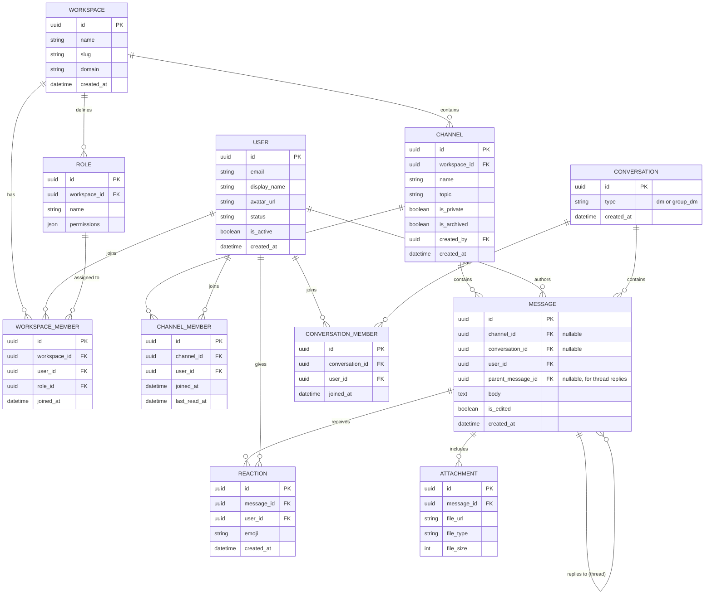

# Slack-style Application — Entity Relationship Diagram

This ERD models the core data structures behind a Slack-like team messaging platform: workspaces, channels, members, messages, threads, reactions, and direct messages.

## Diagram

## Entity Notes

- **WORKSPACE** — the top-level tenant/organization. All channels, members, and roles belong to exactly one workspace.
- **USER** — a person's account, shared across workspaces (a user can belong to multiple workspaces via `WORKSPACE_MEMBER`).
- **WORKSPACE_MEMBER** — join entity linking users to workspaces, carrying a `role_id` for permissions.
- **ROLE** — per-workspace permission sets (e.g. Owner, Admin, Member, Guest).
- **CHANNEL** — a public or private channel within a workspace.
- **CHANNEL_MEMBER** — join entity tracking channel membership and read state.
- **CONVERSATION** — a direct message or group DM thread, separate from channels since DMs aren't tied to a single channel row.
- **CONVERSATION_MEMBER** — join entity for DM/group DM participants.
- **MESSAGE** — a single message, belonging to either a channel or a conversation (not both). Supports threading via a self-referencing `parent_message_id`.
- **ATTACHMENT** — files/media attached to a message.
- **REACTION** — emoji reactions on a message, one row per user per emoji per message.

## Key Relationships

- A **Workspace** has many **Channels**, **Roles**, and **Members**.
- A **User** can be a member of many **Workspaces**, **Channels**, and **Conversations**.
- A **Message** belongs to exactly one of **Channel** or **Conversation**, and may optionally reply to another **Message** (thread).
- **Reactions** and **Attachments** both hang off **Message**, scoped one-to-many.

## Suggested Indexes / Constraints

- All primary and foreign keys use **UUID (v4)**. In Laravel, use `$table->uuid('id')->primary()` (or `HasUuids` trait on the model) instead of auto-incrementing IDs, and `$table->foreignUuid('workspace_id')->constrained()` for foreign keys.
- Unique constraint on (`workspace_id`, `slug`) for **WORKSPACE**.
- Unique constraint on (`channel_id`, `user_id`) for **CHANNEL_MEMBER**.
- Unique constraint on (`conversation_id`, `user_id`) for **CONVERSATION_MEMBER**.
- Unique constraint on (`message_id`, `user_id`, `emoji`) for **REACTION**.
- Check constraint ensuring **MESSAGE** has exactly one of `channel_id` or `conversation_id` set, not both.
- Index on `parent_message_id` in **MESSAGE** for fast thread lookups.
